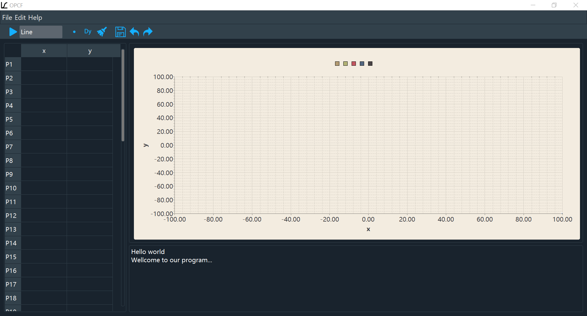

# 个人报告

### 1 分工

+ 第一轮迭代：model的算法层以及common层
+ 第二轮迭代：viewmodel层与model层的函数图像坐标范围计算
+ 第三轮迭代：view层功能添加，界面设计

### 2 设计思路

​      跟据输入的点，以及曲线的种类进行相关的曲线拟合工作，曲线种类有一次函数，二次函数，三次函数，对数函数，指数函数，以及基于三次样条插值的一种拟合曲线。

#### 2.1 三次样条插值得到函数

其基本形式如下：
$$
\begin{equation}
f(x)=\left\{
\begin{aligned}
 & a_0x^3 + b_0 x^2+c_0x+d_0,(x_0,x_1) \\
 & a_1x^3 + b_1 x^2+c_1x+d_1,(x_1,x_2)\\
...\\
& a_nx^3 + b_n x^2+c_nx+d_n,(x_{n-1},x_{n})
\end{aligned}
\right.
\end{equation}
$$
我们采用三次样条插值的方法获以期获得各参数值，且尽量减小误差。

依据三次样条插值的特性，其每一单独函数可表达成如下形式
$$
f(x) = a'(x-x')^3 + b'(x-x)^2+c'(x-x')+d
$$
其算法如下

step 1) i = 0 to n 
$$
a'[i] = y[i]\\
$$


step 2) i = 0 to n-2 
$$
h[i] = x[i+1] - x[i]\\
$$


step 3) i = 1 to n -2
$$
\alpha [i] = \frac{3}{h[i]}*(a[i+1]-a[i])-\frac{3}{h[i-1]}*(a[i]-a[i-1])\\
$$
step 4) 
$$
L[0] = 1,  \mu [0], z[0] = 0\\
$$
step 5) i =1 to n-2
$$
L[i] = 2 * (x[i+1]-x[i-1])-h[i-1]*\mu[i-1]\\
\mu[i]=h[i]/L[i]\\
z[i]=\frac{\alpha[i]-h[i-1]*z[i-1]}{L[i]}\\
$$
step 5)
$$
L[n-1]=1,z[n-1]=0,c'[n-1]=0\\
$$
step 6) i = n-2 to 0
$$
c'[i] = z[i]-\mu[i]*c[i+1]\\
b'[i] = \frac{a'[i+1]-a'[i]}{h[i]}-\frac{h[i]*(c[i+1]+2*c[i])}{3}\\
d'[i] =\frac{c'[i+1]-c'[i]}{3*h[i]}\\
$$


step 7) i = 0  to n-2
$$
c[i]=c'[i]-3*d'[i]*x[i]\\
b[i]=3*d'[i]*x[i]^2-2*c'[i]*x[i]+b'[i]\\
a[i]=a'[i] -b'[i]*x[i] +c'[i]*x[i]^2-d'[i]*x[i]^3\\
d[i] =d'[i]
$$
再将函数式转换成字符串形式。

#### 2.2 common层阐释

##### 2.2.1 point_with_range

​    在此数据结构中，存储了点数，点坐标，以及相邻两点将的函数。

##### 2.2.2 point

​    在此类中，用来存储点的x，y坐标，支持对于坐标的输入输出，可单独对x，y坐标进行设置，也可进行诸如拷贝构造移动复制构造等功能。

##### 2.2.3 Function

   在此类中，存储了函数的字符串形式，以及由该字符串转换来的函数表达式，可以完成诸如函数的输入输出，以及由x值输出函数在该点的函数值或者导函数值等功能。

####2.3 坐标范围计算与文件操作

​   基于MVVM模型，在app层完成数据、命令、通知的绑定，viewmodel层接收到view层的计算范围命令后，调用model层getRange函数，完成后发送通知给view层。

   我们设计了包括打开、保存工程文件、保存函数图像的功能，其中保存工程文件是以TXT文件格式保存拟合函数类型和数据的，保存函数图像支持多种图片格式，例如png、jpg等等。

#### 2.4 UI设计

  使用 Qt的QSS语言进行UI设计。

#####2.4.1 QSS简介

   QSS是Qt借鉴CSS开发的一个文本标记语言。样式表由一系列的样式规则组成。一条样式规则由一个选择器和几条声明语句组成，选择器指明了哪个部件将会受规则影响，而声明语句则指明了哪些属性会设置到这个部件，多个部件间由分号间隔，例如：

```css
QWidget {
  border: 0px solid #32414B;
  padding: 0px;
  color: #F0F0F0;
  selection-background-color: #1464A0;
  selection-color: #F0F0F0;
} 
```

##### 2.4.2 选择器的类型

|   选择器   | 实例                      |
| :--------: | :------------------------ |
| 通用选择器 | *                         |
| 类型选择器 | QPushButton               |
| 属性选择器 | QPushButton[flat=”false”] |
|  类选择器  | QPushButton               |
|  ID选择器  | QPushButton#okButton      |
|  子选择器  | QDialog > QPushButton     |

#####2.4.3 伪状态

| 伪状态         | 含义                           |
| -------------- | ------------------------------ |
| hover          | 鼠标移动到                     |
| hover:checked  | 鼠标移动到被勾选的`CheckBox`   |
| hover:!pressed | 鼠标移动到被按下的`PushButton` |

##### 2.4.4 最终设计效果



### 3 结果说明

结果运行截图可参见总报告

### 4 心得体会

​       在本课程不仅对于以前学习的算法有了更深层次的理解，回顾了大一时的数学知识，且重新获得了一定的计算能力，此外在本课程中还学习了新的MVVM模式，与以前所接触的MVC模式不同，在此模式中各模块中耦合较小，所以在团队协作过程中可以加快很多过程进度，很少出现等待他人完成才可工作的情况，掌握了此种模式在以后的工作学习中应该会有很大的用处。

### 5 改进意见

+ 希望老师可以对MVVM模式的阐述更多一些，这样可以对该模式在前期准备工作时已经有更多的了解

  

